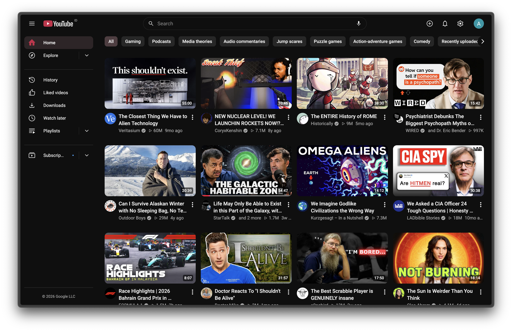
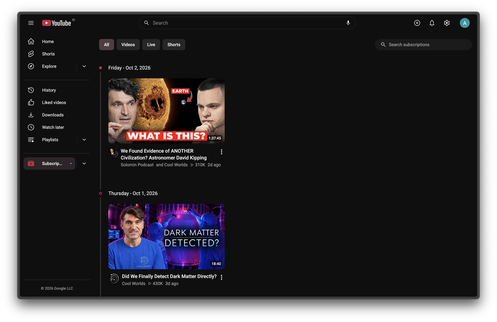
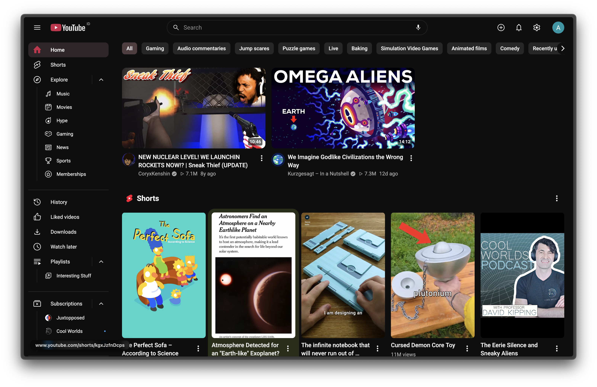
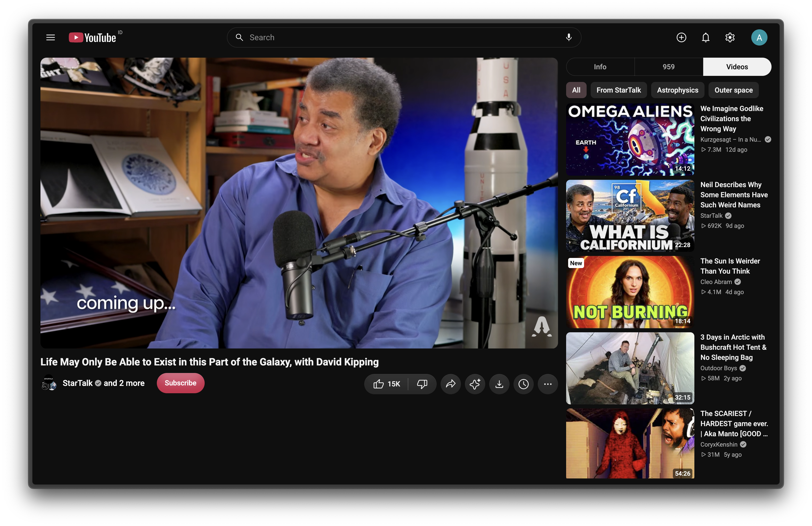
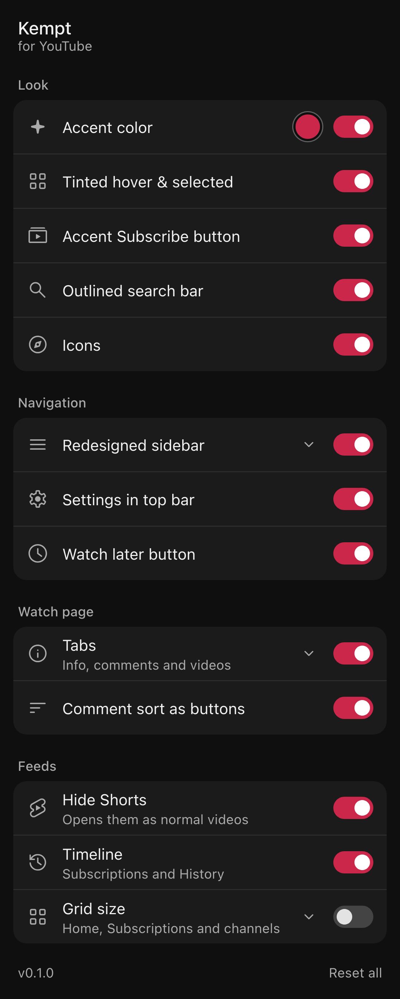

<div align="center">

<h1>Kempt</h1>

<p align="center">
  <a href="https://remonilo.github.io/kempt-yt/docs/">Docs</a>
  ·
  <a href="https://remonilo.github.io/kempt-yt/docs/installation/">Install</a>
  ·
  <a href="https://remonilo.github.io/kempt-yt/docs/faq/">FAQ</a>
  ·
  <a href="https://remonilo.github.io/kempt-yt/docs/privacy/">Privacy</a>
</p>

[](https://github.com/remonilo/kempt-yt/commits/main)
[](https://github.com/remonilo/kempt-yt/issues)
[](https://github.com/remonilo/kempt-yt/stargazers)
[](LICENSE)

### A kempt and consistent redesign of YouTube

One accent color and icon set, and less clutter. Every change is a switch you can turn off.

</div>

<div align="center">
  <table>
    <tr>
      <td colspan="2">
        
      </td>
    </tr>
    <tr>
      <td width="50%">
        
      </td>
      <td width="50%">
        
      </td>
    </tr>
  </table>
</div>
<p align="center">
  <sub>Follows YouTube's light and dark theme. The accent is yours to pick.</sub>
</p>
<br>

> [!NOTE]
> **Kempt changes how YouTube looks, not what it shows.**
>
> It blocks no ads, downloads nothing and works around no restrictions. It moves and restyles YouTube's own elements, and every button keeps YouTube's own behavior.

## Features

- **Watch page tabs.** Info, Comments, Videos, Live chat and Ask AI share one panel beside the player. Only the open tab scrolls. <details><summary><sup>click to see the tabs</sup></summary></details>
- **Subscriptions timeline.** Uploads under date headers, with All / Videos / Live / Shorts chips and a search box. History also gets the same headers.
- **Redesigned sidebar.** Explore, Subscriptions and Playlists as dropdowns, and the entries you never use hidden.
- **One accent and one icon set** across chips, tabs, the progress bar, Subscribe and every button. The icons are drawn over YouTube's own buttons.
- **Small fixes.** An outlined search bar, Settings in the top bar, a Watch later button, and comment sort as chips.
- **Grid size.** Choose how many videos and Shorts fill each row on Home, Subscriptions and channels.
- **No Shorts.** Shelves hidden everywhere and Shorts links open in the normal player.
- **Every change is a switch.** Pop-up has all the settings needed, only a switch away. <details><summary><sup>click to see the popup</sup></summary><!-- PLACEHOLDER: popup --><br></details>
- **Your language.** Labels follow YouTube's UI language, in 11 languages.
- **Light on battery.** no polling or page-wide observers, and compositor-only animations. Reduced motion is respected.

## Quick start

[<kbd><br>install<br></kbd>][install_link]
[<kbd><br>settings<br></kbd>][settings_link]
[<kbd><br>how it works<br></kbd>][internals_link]

## Installation

### Firefox

Firefox 128 or later: [Firefox Add-ons][firefox_link].

### Chrome, Edge, Brave

Any Chromium browser: [Chrome Web Store][chrome_link].

### From source

Needs Node.js 22 or later.

```sh
git clone https://github.com/remonilo/kempt-yt
cd kempt-yt
npm i
npm run build
```

- **Firefox:** `about:debugging` → This Firefox → Load Temporary Add-on → `dist/manifest.json`
- **Chrome:** `chrome://extensions` → Developer mode → Load unpacked → `dist/`

Reload any YouTube tab that was open before.

## Privacy

Kempt collects nothing and has no server. It asks for one permission, `storage`, for your settings, and runs on `www.youtube.com` only. The few requests it makes go to YouTube, from your session, the same ones YouTube's own menus send. [Details][privacy_link].

## Contributing

```sh
npm run dev      # watch build into dist/
npm run check    # typecheck
npm test         # node --test
```

TypeScript, no framework or runtime dependencies. A feature is one folder in `src/features/<id>/` plus one line in `src/features/index.ts`. Start with [Adding a feature][add_link]. [`PLAN.md`](PLAN.md) records every design decision and the lessons learned about YouTube's DOM.

Bug reports help most with your browser, window width, YouTube language, signed in or out, and the steps to reproduce.

The docs site lives in `site/` (Astro + Starlight): `cd site && npm i && npm run dev`.

## Translations

Kempt's own labels exist in English, Spanish, Portuguese, German, French, Russian, Japanese, Korean, Hindi, Indonesian and Turkish. The non-English ones were written without a native speaker. If you speak one, read the `WORDS` tables in `src/features/*/index.ts` and open a PR.

## Motivation

YouTube's UI is built from many teams' parts: three icon styles, accents that change from page to page, unexplainable clutter from years of features added. Kempt brings it back to one design. It started from Juxtopposed's YouTube redesign concept and grew into something I use every day.

## Credits

Icons come from Juxtopposed's _YouTube Redesign (Community)_ [Figma](https://www.figma.com/community/file/1450380484645543336/youtube-redesign) with gaps filled from [Hugeicons](https://hugeicons.com) (MIT). Kempt is not affiliated with or endorsed by YouTube or Google.

## License

[MIT](LICENSE)

<!---------------------------------------------------------------------------->

[firefox_link]: https://addons.mozilla.org/firefox/addon/PLACEHOLDER
[chrome_link]: https://chromewebstore.google.com/detail/PLACEHOLDER
[install_link]: https://remonilo.github.io/kempt-yt/docs/installation/
[settings_link]: https://remonilo.github.io/kempt-yt/docs/settings/
[internals_link]: https://remonilo.github.io/kempt-yt/docs/internals/architecture/
[add_link]: https://remonilo.github.io/kempt-yt/docs/internals/adding-a-feature/
[privacy_link]: https://remonilo.github.io/kempt-yt/docs/privacy/
